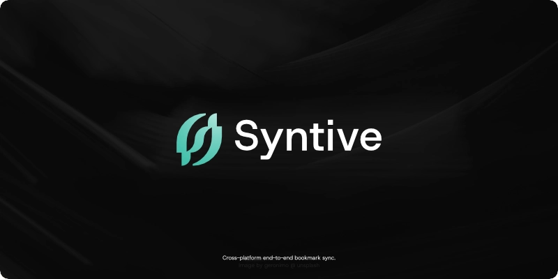

<div align="center">
  

# Syntive

A bookmark sync extension for Chromium & Firefox — zero-knowledge end-to-end encrypted, powered by Cloudflare Workers & D1.

[Report an Issue](https://github.com/bismawy/syntive/issues) · [Bahasa Indonesia](README-id.md)

[](https://github.com/bismawy/syntive/actions/workflows/build-extension.yml)


</div>



## Features

- **New Tab Dashboard:** Clean, distraction-free new-tab interface featuring draggable widgets (Clock, Bookmark Stats, Favorite Sites, Most Visited, Notes, Todo, Pomodoro, Hijri Calendar, Quran Radio, and Nature Ambience).
- **Zero-Knowledge E2E Sync:** The bookmark tree is encrypted locally with 256-bit AES-GCM before leaving the device. The server only stores opaque ciphertext blobs and cannot read your data.
- **Multi-Device & Session Management:** Monitor connected devices, view recent sync history, and terminate remote sessions on demand. Conflicts are resolved via *last-write-wins*.
- **Smart Bookmark Utilities:**
  - Duplicate link scanner with canonical URL normalization.
  - Recursive merge for folders with identical names.
  - Domain-based bookmark grouping into subfolders.
  - Safe empty folder cleaner (protects browser system roots).
- **Trash Bin:** 30-day retention period with one-click recovery for deleted bookmarks and folders.
- **Customization & Themes:** Light, Dark, and System modes, color scheme presets, and custom accent color import from GitHub.
- **Bilingual Interface:** Available in English and Indonesian.

## Security Model

A 12-word mnemonic Secret Key is derived locally in the browser via native Web Crypto APIs:

```text
12-Word Mnemonic (Secret Key)
   └─ PBKDF2-SHA512 (salt="syntive/v1", 210,000 iterations, 64 bytes)
        ├─ seed[0:32]  -> authId (Hex) used as account identity & bearer token
        └─ seed[32:64] -> encKey (256-bit AES-GCM) for client-side encryption & decryption
```

- The mnemonic and encryption keys **never leave your device**.
- Cloudflare Workers only receive the `authId` and the GZIP-compressed ciphertext blob.
- If you lose your Secret Key, your data cannot be recovered since the server never stores your private key.

<details>
<summary><b>Vault Storage Format Details (SYN1)</b></summary>

```text
[SYN1 (4B)][IV (12B)][AES-GCM Ciphertext (GZIP-compressed JSON Payload)] -> Base64
```
Payload is compressed before encryption to reduce bandwidth and D1 database storage consumption by up to ~70%.
</details>

## Setup & Deployment Guide

<details open>
<summary><b>1. Self-Host Backend (Cloudflare Worker + D1)</b></summary>

Syntive is fully database-agnostic. You can connect the extension to your own Cloudflare account:

1. **Log in to Cloudflare with Wrangler:**
   ```bash
   cd backend
   bun install
   bunx wrangler login
   ```

2. **Create a D1 database:**
   ```bash
   bunx wrangler d1 create syntive
   ```
   Copy the printed `database_id` into `backend/wrangler.toml`:
   ```toml
   [[d1_databases]]
   binding = "DB"
   database_name = "syntive"
   database_id = "YOUR-DATABASE-UUID"
   migrations_dir = "migrations"
   ```

3. **Apply database migrations:**
   ```bash
   bunx wrangler d1 migrations apply syntive --remote
   ```

4. **Deploy the Worker:**
   ```bash
   bunx wrangler deploy
   ```

5. **Connect the extension to your Worker:**
   Create `extension/.env` from the template:
   ```bash
   cd ../extension
   cp .env.example .env
   ```
   Set `VITE_API_BASE` to your deployed Worker URL (e.g., `https://syntive.<subdomain>.workers.dev`).
</details>

<details>
<summary><b>2. Local Extension Development</b></summary>

```bash
cd extension
bun install
bun run dev
```

- **Chrome / Edge / Brave:** Open `chrome://extensions`, enable *Developer mode*, click *Load unpacked*, and select `extension/.output/chrome-mv3`.
- **Firefox:** Open `about:debugging#/runtime/this-firefox`, click *Load Temporary Add-on*, and choose `manifest.json` in `extension/.output/firefox-mv2`.
</details>

<details>
<summary><b>3. Build & Packaging (.zip)</b></summary>

From the project root:

```bash
# Production build for both Chrome and Firefox
bun run build:ext

# Package into zip archives for release
bun run zip:ext
```

Zip outputs are saved to the `extension/.output/` folder.
</details>

<details>
<summary><b>4. Type Checking & Self-Checks</b></summary>

```bash
bun run typecheck
bun run extension/lib/crypto.selfcheck.ts
bun run extension/lib/bookmarkManagement.selfcheck.ts
bun run extension/lib/sync.selfcheck.ts
```
</details>

## Project Structure

<details>
<summary><b>View Directory Structure</b></summary>

```text
.
├── backend/                        # Cloudflare Worker native & D1 database
│   ├── migrations/                 # Vault and device schema migrations
│   ├── src/index.ts                # Worker API handler & CORS
│   └── wrangler.toml               # Cloudflare D1 binding configuration
│
├── extension/                      # Browser extension (WXT + React + Tailwind)
│   ├── components/                 # UI components, Dashboard, Bookmarks, Management, Modals
│   ├── entrypoints/                # Background service worker, newtab, and popup
│   ├── lib/                        # Crypto, sync engine, i18n, themes, and utilities
│   └── wxt.config.ts               # WXT framework configuration
│
├── design/                         # Visual assets & mockups
└── package.json                    # Workspace root scripts
```
</details>

## License

Distributed under the **Apache-2.0** license. See [LICENSE](LICENSE) for more details.

## Developer

Developed and maintained by [Bisma](https://github.com/bismawy).
